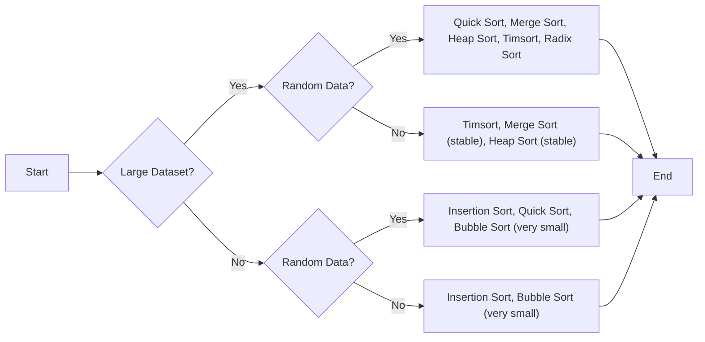

# Push_swap
---

Todo
- Circular double direction linked list augmented
- quick sort wiht two stacks
- turk
- test how to do your algo https://github.com/stevebalk/push-swap-clicker


[Tutotrial](https://medium.com/nerd-for-tech/push-swap-tutorial-fa746e6aba1e)
[Tutorial 2](https://github.com/42YerevanProjects/push_swap)
https://push_swap.simple.ink/


## 1. Big O (time&space compley)
> computation usage

|                     | Algorithm            | Best Case  | Worst Case | Space Complexity | Constant Factor | Better at                                                                                        |
| :------------------ | :------------------- | :--------- | :--------- | :--------------- | :-------------- | :----------------------------------------------------------------------------------------------- |
| **Small Data Sets** |                      |            |            |                  |                 |                                                                                                  |
|                     | Insertion Sort       | O(n)       | O(n^2)     | O(1)             | 1 - 5           | Very efficient for small or nearly sorted data.                                                  |
|                     | Selection Sort       | O(n^2)     | O(n^2)     | O(1)             | 2 - 10          | Small large datasets                                                                             |
|                     | Timsort              | O(n)       | O(n log n) | O(n)             | 2 - 10          | Very efficient for small or nearly sorted data.                                                  |
|                     | Shell Sort           | O(n log n) | O(n^2)     | O(1)             | 5 - 20          | simple, a generalization of insertion sort.                                                      |
| **Large Data Sets** |                      |            |            |                  |                 |                                                                                                  |
|                     | Radix Sort (binary)  | O(nk)      | O(nk)      | O(n)             | 5 - 20          | Large data sets, but Small bits (small digits)                                                   |
|                     | Radix Sort (base 10) | O(nk)      | O(nk)      | O(n)             | 10 - 50         | Large data sets, but Small number digits                                                         |
|                     | Merge Sort           | O(n log n) | O(n log n) | O(n)             | 5 - 50          | Random Data<br>Better at worst case scenario and when space complexty is not a concern           |
|                     | Quick Sort           | O(n log n) | O(n^2)     | O(log n)         | 2 - 20          | Random Data<br>Better at best case scenario, when data is nearly sorted or pivot is badly chosen |
|                     | Heap Sort            | O(n log n) | O(n log n) | O(1)             | 5 - 30          | Random Data<br>Better at worst case scenario                                                     |
|                     | Bubble Sort          | O(n)       | O(n^2)     | O(1)             | 1 - 5           | Simple, but inefficient for large datasets.                                                      |




#### Algos by their Types
---
- **Small Data**
	- Simple Implementation and Nearly sorted data
		- Insertion Sort (most simple, cards sorting)
		- Bubble Sort (for very small datasets and simplicity)
	- Effective 
		- Selection (most efficient in worst case)
- **Large Data**
	- Binary tree(divide and conquer)
		- Quick (bottom up approach, bad at worst case )
		- Merge (bottom up approach, stable )
		- Heapfy (max or min heap, stable)
	- Hash tables 
		- Bucket (by ranges)
		- Radix (by decimals)
	- Others
		- Tim (merge+insertion)


- **Explanation of added algorithms:**

	- **Radix Sort (base 10):** Similar to binary radix sort, but uses 10 buckets (0-9) for each digit. It's often used when dealing with decimal numbers directly.
	- **Bubble Sort:** Repeatedly steps through the list, compares adjacent elements, and swaps them if they are in the wrong order. Simple1 but inefficient for larger datasets.
	- **Shell Sort:** A generalization of insertion sort that allows the exchange of items that are far apart. Improves on insertion sort by breaking the original list into smaller sublists.
	- **Timsort:** A hybrid sorting algorithm derived from merge sort and insertion sort. Designed to perform well on many kinds of real-world data. It's2 used in Python and Java's standard libraries.

	- **Points to note:**

		- **Quick Sort's Worst Case:** While Quick Sort typically has O(n log n) performance, its worst-case time complexity can be O(n^2) if the pivot selection repeatedly results in unbalanced partitions.
		- **Shell Sort's Complexity:** The time complexity of Shell Sort depends on the gap sequence used, and it's difficult to give a precise expression.
		- **Choosing an Algorithm:** The best algorithm for your `push_swap` project will depend on various factors, including the size of the input, the desired performance, and the specific constraints of the `push_swap` rules.

## 2. Algos
### Bubble Sort
### Insertion Sort
### Quick Sort
### Heap Sort
### Merge Sort
###  Radix Sort Algo 
#### 1.1 The logic

#### 1.2The 10 boxes
The numbers
`87 487 781 100 101 0 1`

1. First interaction (first digit)
```
box 0    100    0
box 1    781    101    1
box 2
box 3
box 4
box 5
box 6
box 7     87    487
box 8
box 9
```
connecting
`100 0 781 101 1 87 487`

2. Second interaction (second digit)
```
box 0    100    0      101    1
box 1               
box 2
box 3
box 4
box 5
box 6
box 7     
box 8     781    87    487
box 9
```
connecting
`100 0 101 1 781 87 487`
3. third
```
box 0    0       1    87
box 1    100    101 
box 2
box 3
box 4    487
box 5
box 6
box 7     781 
box 8        
box 9
```
connecting
> `0 1 87 100 101 487 781`

...

for n times = times the size of the biggest number

###  Binary Radix Sort Algo
>[!Note] Instead of 10 boxes we will use 2 stacks for 0 and 1
>Going from base10 to base2
-
#### 2.1 Need to learn bitwise operations 
- [LINK](https://www.programiz.com/c-programming/bitwise-operators?source=post_page-----fa746e6aba1e--------------------------------)
#### 2.2 The algo logic for binaries
>2. Sorting process:
    - We start from the least significant bit (rightmost) and move towards the most significant bit (leftmost).
    - For each bit position:
        - If the bit is 0, we move the number to stack B (pb - push to B).
        - If the bit is 1, we rotate stack A (ra - rotate A), keeping the number in A.
    - After processing all numbers for a bit, we move all numbers from B back to A (pa - push to A).
    - We repeat this process for each bit.

### Algo Turk Machine
-![[turk_machine.jpg]] 
- [link](https://medium.com/@ayogun/push-swap-c1f5d2d41e97)


## 3. Prototype 
``` c
#include <stdlib.h>
#include <unistd.h>
#include <stdio.h>
#define PRINT_COMMANDS 0

// Push a: Take the first element from b and put it on top of a
void    ft_pa(int *stack_a, int *stack_b, int *size_a, int *size_b, int *instruction_count)
{
    int i;

    if (*size_b <= 0)
        return; // Nothing to push

    // Shift elements in stack_a up to make space
    for (i = *size_a; i > 0; i--)
        stack_a[i] = stack_a[i - 1];

    // Move the top element from stack_b to stack_a
    stack_a[0] = stack_b[0];

    // Shift elements in stack_b down
    for (i = 0; i < *size_b - 1; i++)
        stack_b[i] = stack_b[i + 1];

    (*size_a)++;
    (*size_b)--;

	if(PRINT_COMMANDS)
    	write(1, "pa\n", 3); // Output the instruction
	(*instruction_count)++;
}

// Push b: Take the first element from a and put it on top of b
void    ft_pb(int *stack_a, int *stack_b, int *size_a, int *size_b, int *instruction_count)
{
    int i;

    if (*size_a <= 0)
        return; // Nothing to push

    // Shift elements in stack_b up to make space
    for (i = *size_b; i > 0; i--)
        stack_b[i] = stack_b[i - 1];

    // Move the top element from stack_a to stack_b
    stack_b[0] = stack_a[0];

    // Shift elements in stack_a down
    for (i = 0; i < *size_a - 1; i++)
        stack_a[i] = stack_a[i + 1];

    (*size_a)--;
    (*size_b)++;

	if(PRINT_COMMANDS)
    	write(1, "pb\n", 3); // Output the instruction
	(*instruction_count)++;
}

// Rotate a: Shift up all elements of stack a by 1
void    ft_ra(int *stack_a, int size_a, int *instruction_count)
{
    int i;
    int temp;

    if (size_a <= 1)
        return; // Nothing to rotate

    temp = stack_a[0]; // Store the first element

    // Shift elements up
    for (i = 0; i < size_a - 1; i++)
        stack_a[i] = stack_a[i + 1];

    stack_a[size_a - 1] = temp; // Place the first element at the end

    if(PRINT_COMMANDS)
		write(1, "ra\n", 3);
	(*instruction_count)++;
}
void    radix_sort(int *stack_a, int *stack_b, int size_a, int size_b)
{
    int max_num = size_a - 1;
    int max_bits = 0;
    int i, j;
    int original_size_a = size_a;
	int instruction_count = 0;

	// Find the actual maximum number
    for (i = 1; i < size_a; i++) {
        if (stack_a[i] > max_num) {
            max_num = stack_a[i];
        }
    }

    // Find the maximum number of bits required
    while ((max_num >> max_bits) != 0)
        max_bits++;

    for (i = 0; i < max_bits; i++)
    {
        for (j = 0; j < original_size_a; j++) // Use original_size_a here
        {
            if (((stack_a[0] >> i) & 1) == 0)
                ft_pb(stack_a, stack_b, &size_a, &size_b, &instruction_count);
            else
                ft_ra(stack_a, size_a, &instruction_count);
        }
        while (size_b > 0)
            ft_pa(stack_a, stack_b, &size_a, &size_b, &instruction_count);
    }
	printf("\n##Instructions:\n%d (700)\n", instruction_count);
}

int main (){
    int stack_a[] = {8101, 7461, 5207, 2263, 794, 1986, 234, 1825, 7635, 330, 9009, 8744, 1721, 9822, 1356, 3982, 5916, 4214, 5722, 8575, 4015, 5647, 5194, 2910, 5441, 9998, 1054, 8931, 7322, 2270, 4027, 8712, 2772, 5688, 5088, 3425, 5884, 4559, 5279, 9383, 3755, 3747, 5621, 539, 6543, 2580, 1945, 5892, 9243, 5835, 3561, 2104, 2548, 1099, 6267, 8366, 8588, 1129, 8593, 9925, 6967, 8993, 8034, 151, 5564, 5463, 3740, 5083, 7893, 8623, 7500, 9025, 4179, 9577, 3167, 591, 4492, 715, 3737, 5128, 6362, 1933, 4369, 7252, 1954, 9354, 7711, 861, 7532, 2095, 8711, 1357, 334, 6942, 6878, 1009, 4395, 5846, 1695, 1859};
	int stack_b [100];
	int stack_a_size = 100;
	
	printf("##The Array\n");
	printf("Size:%d\n", stack_a_size);
	for(int i = 0; i < 20; i++){
		printf("%d,", stack_a[i]);
	}
	printf("\n");

	radix_sort(stack_a, stack_b, stack_a_size, 0);
	
	printf("\n##The Sorted\n");
	for(int i = 0; i < 20; i++){
		printf("%d,", stack_a[i]);
	}
	return 0;
}
```


# Notes Mukha
4           
5
7
8
9
6
45