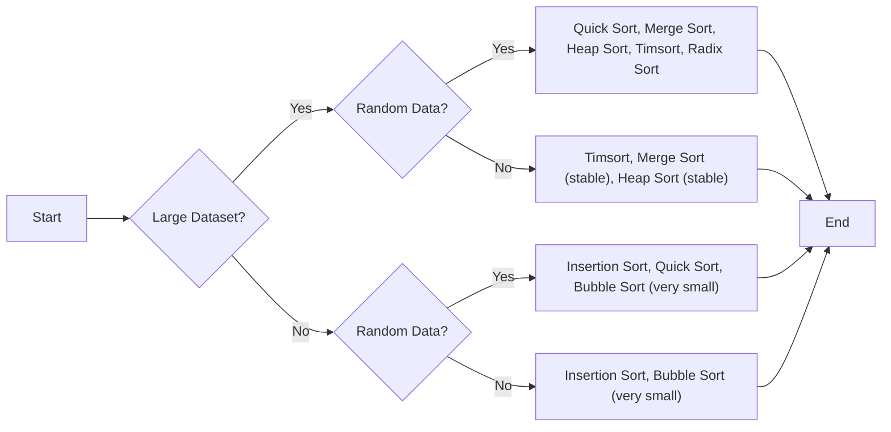

# Push_swap
---


[Tutotrial](https://medium.com/nerd-for-tech/push-swap-tutorial-fa746e6aba1e)
[Tutorial 2](https://github.com/42YerevanProjects/push_swap)

## 1. Big O
> computation usage

| Algorithm            | Big O Notation | Best Case  | Average Case   | Worst Case | Space Complexity |
| :------------------- | :------------- | :--------- | :------------- | :--------- | :--------------- |
| Radix Sort (binary)  | O(nk)          | O(nk)      | O(nk)          | O(nk)      | O(n)             |
| Radix Sort (base 10) | O(nk)          | O(nk)      | O(nk)          | O(nk)      | O(n)             |
| Insertion Sort       | O(n^2)         | O(n)       | O(n^2)         | O(n^2)     | O(1)             |
| Selection Sort       | O(n^2)         | O(n^2)     | O(n^2)         | O(n^2)     | O(1)             |
| Merge Sort           | O(n log n)     | O(n log n) | O(n log n)     | O(n log n) | O(n)             |
| Quick Sort           | O(n log n)     | O(n log n) | O(n log n)     | O(n^2)     | O(log n)         |
| Heap Sort            | O(n log n)     | O(n log n) | O(n log n)     | O(n log n) | O(1)             |
| Bubble Sort          | O(n^2)         | O(n)       | O(n^2)         | O(n^2)     | O(1)             |
| Shell Sort           | O(n log n)     | O(n log n) | depends on gap | O(n^2)     | O(1)             |
| Timsort              | O(n log n)     | O(n)       | O(n log n)     | O(n log n) | O(n)             |


| Algorithm            | Best Case  | Worst Case | Space Complexity | Constant Factor | Better at                                                                                        |
| :------------------- | :--------- | :--------- | :--------------- | :-------------- | :----------------------------------------------------------------------------------------------- |
| **Small Data Sets**  |            |            |                  |                 |                                                                                                  |
| Insertion Sort       | O(n)       | O(n^2)     | O(1)             | 1 - 5           | Very efficient for small or nearly sorted data.                                                  |
| Selection Sort       | O(n^2)     | O(n^2)     | O(1)             | 2 - 10          | Small large datasets                                                                             |
| Timsort              | O(n)       | O(n log n) | O(n)             | 2 - 10          | Very efficient for small or nearly sorted data.                                                  |
| Shell Sort           | O(n log n) | O(n^2)     | O(1)             | 5 - 20          | simple, a generalization of insertion sort.                                                      |
| **Large Data Sets**  |            |            |                  |                 |                                                                                                  |
| Radix Sort (binary)  | O(nk)      | O(nk)      | O(n)             | 5 - 20          | Large data sets, but Small bits (small digits)                                                   |
| Radix Sort (base 10) | O(nk)      | O(nk)      | O(n)             | 10 - 50         | Large data sets, but Small number digits                                                         |
| Merge Sort           | O(n log n) | O(n log n) | O(n)             | 5 - 50          | Random Data<br>Better at worst case scenario and when space complexty is not a concern           |
| Quick Sort           | O(n log n) | O(n^2)     | O(log n)         | 2 - 20          | Random Data<br>Better at best case scenario, when data is nearly sorted or pivot is badly chosen |
| Heap Sort            | O(n log n) | O(n log n) | O(1)             | 5 - 30          | Random Data<br>Better at worst case scenario                                                     |
| Bubble Sort          | O(n)       | O(n^2)     | O(1)             | 1 - 5           | Simple, but inefficient for large datasets.                                                      |




#### Algos by time complexity
---
- **Good for Large Datasets:**
    -  Random Data:
        - Quick Sort(not good at worst case scenario)
        - Merge Sort
        - Heap Sort
        - Timsort
        - Radix Sort (binary/base 10) 
    - Nearly Sorted:
        - Timsort 
        - Merge Sort (stable)
        - Heap Sort (stable)

- **Good for Small Datasets:**
    * Random Data:
        - Insertion Sort
        - Quick Sort
        - Bubble Sort (for very small datasets and simplicity)
    * Nearly Sorted:
        - Insertion Sort
        - Bubble Sort (for very small datasets and simplicity) 


**Explanation of added algorithms:**

- **Radix Sort (base 10):** Similar to binary radix sort, but uses 10 buckets (0-9) for each digit. It's often used when dealing with decimal numbers directly.
- **Bubble Sort:** Repeatedly steps through the list, compares adjacent elements, and swaps them if they are in the wrong order. Simple1 but inefficient for larger datasets.
- **Shell Sort:** A generalization of insertion sort that allows the exchange of items that are far apart. Improves on insertion sort by breaking the original list into smaller sublists.
- **Timsort:** A hybrid sorting algorithm derived from merge sort and insertion sort. Designed to perform well on many kinds of real-world data. It's2 used in Python and Java's standard libraries.

**Points to note:**

- **Quick Sort's Worst Case:** While Quick Sort typically has O(n log n) performance, its worst-case time complexity can be O(n^2) if the pivot selection repeatedly results in unbalanced partitions.
- **Shell Sort's Complexity:** The time complexity of Shell Sort depends on the gap sequence used, and it's difficult to give a precise expression.
- **Choosing an Algorithm:** The best algorithm for your `push_swap` project will depend on various factors, including the size of the input, the desired performance, and the specific constraints of the `push_swap` rules.

## 2. Algos
### Quick Sort
### Heap Sort
###  Radix Sort Algo 
#### 1.1 The logic

#### 1.2The 10 boxes
The numbers
`87 487 781 100 101 0 1`

1. First interaction (first digit)
```
box 0    100    0
box 1    781    101    1
box 2
box 3
box 4
box 5
box 6
box 7     87    487
box 8
box 9
```
connecting
`100 0 781 101 1 87 487`

2. Second interaction (second digit)
```
box 0    100    0      101    1
box 1               
box 2
box 3
box 4
box 5
box 6
box 7     
box 8     781    87    487
box 9
```
connecting
`100 0 101 1 781 87 487`
3. third
```
box 0    0       1    87
box 1    100    101 
box 2
box 3
box 4    487
box 5
box 6
box 7     781 
box 8        
box 9
```
connecting
> `0 1 87 100 101 487 781`

...

for n times = times the size of the biggest number

###  Binary Radix Sort Algo
>[!Note] Instead of 10 boxes we will use 2 stacks for 0 and 1
>Going from base10 to base2
-
#### 2.1 Need to learn bitwise operations 
- [LINK](https://www.programiz.com/c-programming/bitwise-operators?source=post_page-----fa746e6aba1e--------------------------------)
#### 2.2 The algo logic for binaries
>2. Sorting process:
    - We start from the least significant bit (rightmost) and move towards the most significant bit (leftmost).
    - For each bit position:
        - If the bit is 0, we move the number to stack B (pb - push to B).
        - If the bit is 1, we rotate stack A (ra - rotate A), keeping the number in A.
    - After processing all numbers for a bit, we move all numbers from B back to A (pa - push to A).
    - We repeat this process for each bit.

### Algo Turk Machine
-![[turk_machine.jpg]] 
- [link](https://medium.com/@ayogun/push-swap-c1f5d2d41e97)
- 